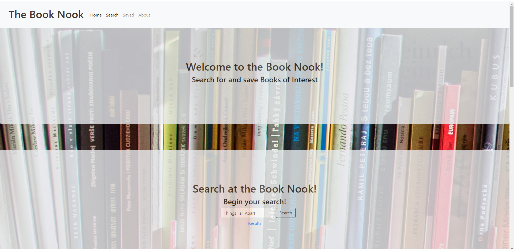
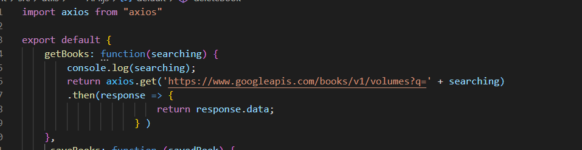
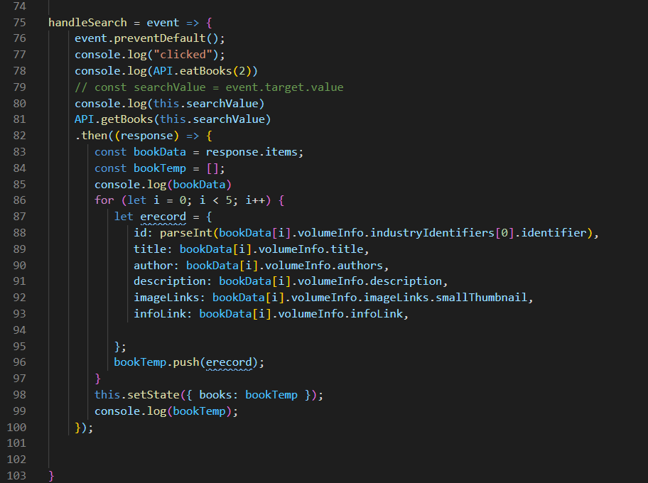
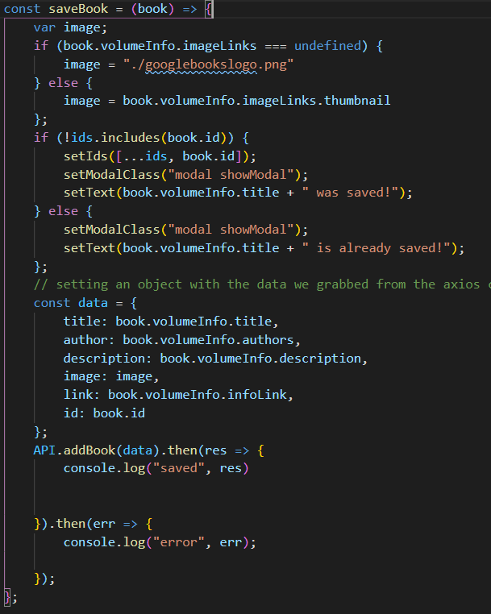

# Book Search

### A simple app to help you search books- I called it "The Book Nook"

## Table of Contents
* [Technologies Used](Technologies_Used)
* [Deployed Site](Deployed)
* [Features](Features)
* [Usage](Usage)
* [Author](Author)
* [Credits](Credits)
* [License](License)

## Technologies_Used
* HTML 
* CSS
* React.js
* mongo
* express
* mongoose
* Atlas_db
* heroku 

## Deployed Site
[ClickClick!](https://pure-dawn-66807.herokuapp.com/)

## Features 
 

__1. A book Search__
 
In order to make a book search work in react- we need an axios call. However, for this search the axios call does not need to be on the back end. I built my axios call in the API section and then built out a search page. 

<!--  -->

__2. A Saved Search__

A way to sort through and look through all the work you have saved. Originally, I was doing my saved books using a ComponentdidMount() function -however my code had a lot of problems and I couldn't get it to work very well.

So, in order to make it actually work - I changed to doing useEffects() which is not only simpler code but much more effective in this instance. However, that was not my major problem when it came to getting things to save. I had my databases mis-named! Going through each line of code I was able remedy the situation and learn a lot in the process.

__3. A deployed site__

What?

In order to deploy our code we must use a service like heroku, that allows for server side and front end code. Heroku is great because it offers a free service that allows you to use databases in the back end, a thing not offered by github pages. In order to use MongoDB with heroku a set of special steps must be followed (that are different from using either mysql or no database).

How?

Basic Steps:

Set up a MongoDB Atlas account by going to https://www.mongodb.com/cloud/atlas/signup. Make sure you sign up for a shared (free cluster), that you are using the AWS Provider, that you use a password, set atlas admin as your database privileges and that you allow network access from anywhere.
Create a database by going to clusters, collections and naming your database. Make sure it worked before moving on.
Connect your database to heroku by navigating to the heroku settings section on your newly created (by "heroku create" in your vs code terminal of the code you want to create ) app-by adding config settings.
To add config settings, type in MONGODB_URI in they key of your config settings and getting your connection string with your username/password/database from your cluster in the connection settings.
Then insert this code: 'mongoose.connect( process.env.MONGODB_URI || 'mongodb://localhost/deep-thoughts', { useNewUrlParser: true, useUnifiedTopology: true, useCreateIndex: true, useFindAndModify: false } ); ' into the place where you call those sorts things, also known as the server.js

__4. Others__

MIA - deleting the book (yes there is a button) but for some silly reason it doesn't work, I know it almost works though - just needs a little finangling

Switch Pages - it took me a bit to get these but it made so I didn't have to rely to heavily on away functions to get the saved searches to show up. Not having a search and a save on the same page helps a ton.

## Usage
### How do you use this project? How ever you would like.
 
## Author 
Rachael Kelm-Southworth

* [linkedin](https://www.linkedin.com/in/rachael-kelm-southworth-87a3831b3) 

* [Portfolio](https://rksouth.github.io/Portfolio/ )

* [github](https://github.com/RKSouth/)

 ## Credits

I would like to thank Kerwin, Manuel, Roger, Jerome and all my classmates for helping me understand this subject matter and anyone that contributed to make the base code.

## License
[MIT](https://choosealicense.com/licenses/mit/)

