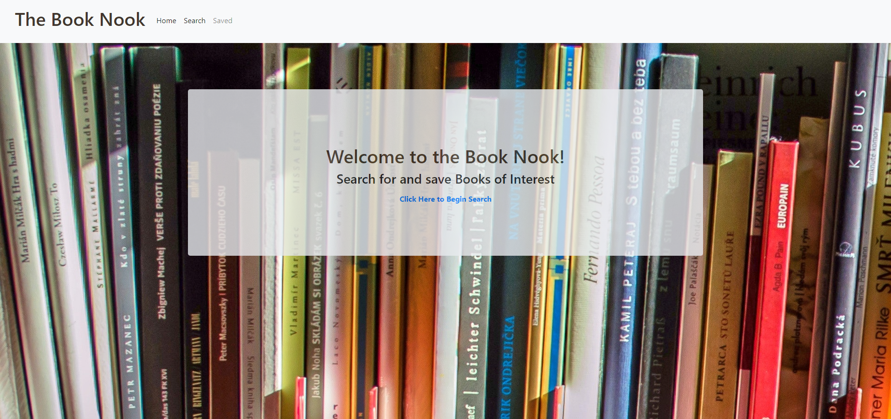

# Book Search

### A simple app to help you search books

## Table of Contents
* [Technologies Used](Technologies_Used)
* [Deployed Site](Deployed)
* [Features](Features)
* [Usage](Usage)
* [Author](Author)
* [Credits](Credits)
* [License](License)

## Technologies_Used
* HTML 
* CSS
* React.js
* mongo
* express
* mongoose

## Deployed Site
[ClickClick!](https://rksouth.github.io/React-Portfolio/)

## Features 

__1. A book Search__
 

__2. A Saved Search__

__3. A Delete Search__

## Usage
### How do you use this project? How ever you would like.
 
## Author 
Rachael Kelm-Southworth

* [linkedin](https://www.linkedin.com/in/rachael-kelm-southworth-87a3831b3) 

* [Portfolio](https://rksouth.github.io/Portfolio/ )

* [github](https://github.com/RKSouth/)

 ## Credits

I would like to thank Kerwin, Manuel, Roger, Jerome and all my classmates for helping me understand this subject matter and anyone that contributed to make the base code.

## License
[MIT](https://choosealicense.com/licenses/mit/)

